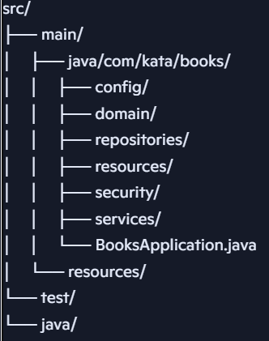

# kata-bookstore-back
KATA Bookstore Backend

# 📚 Books Application

Este projeto é uma aplicação desenvolvida em **Spring Boot** para gerenciamento de livros.  
A estrutura segue o padrão de camadas, garantindo separação de responsabilidades e maior organização do código.

---

## 🏗️ Estrutura de Pastas




---

## 🔹 Camadas

### 1. **config/**
Contém classes de configuração da aplicação, como:
- Configuração de beans.
- Integração com bibliotecas externas.
- Customizações do Spring Boot.

---

### 2. **domain/**
Representa o **modelo de negócio**:
- Classes de entidades (ex.: `Livro`, `Autor`, `Assunto`).
- Mapeamento JPA/Hibernate.
- Regras básicas de domínio.

---

### 3. **repositories/**
Responsável pela **persistência de dados**:
- Interfaces que estendem `JpaRepository` ou `CrudRepository`.
- Consultas customizadas com Spring Data JPA.
- Exemplo: `LivroRepository`, `AutorRepository`.

---

### 4. **resources/**
Camada de **controladores REST**:
- Classes anotadas com `@RestController`.
- Definição dos endpoints da API.
- Recebem requisições HTTP e delegam para os serviços.

---

### 5. **security/**
Gerencia a **segurança da aplicação**:
- Configuração de autenticação e autorização.
- Filtros de segurança.
- Integração com JWT ou OAuth2.

---

### 6. **services/**
Camada de **lógica de negócio**:
- Implementa regras e validações.
- Orquestra chamadas entre repositórios e controladores.
- Exemplo: `LivroService`, `AutorService`.

---

### 7. **BooksApplication.java**
Classe principal da aplicação:
- Contém o método `main`.
- Inicializa o Spring Boot.

---

## 🔹 Testes
A pasta `test/java` contém os testes unitários e de integração:
- Validação das regras de negócio.
- Testes de endpoints REST.
- Garantia de qualidade e estabilidade do código.

---

## 🚀 Como executar

1. Clone o repositório:
   ```bash
   git clone <url-do-repo>
